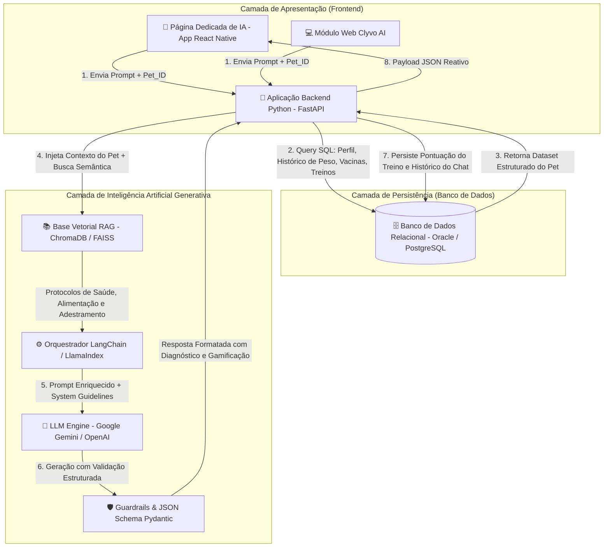

# 📋 Backlog Master Azure Boards — Sprint 3: Disruptive Architectures (IoT, IoB & Generative IA)

> **Projeto:** Clyvo Vet / Pet Guardian (Challenge Clyvo 2026 — 2º Semestre)  
> **Disciplina:** Disruptive Architectures: IoT, IoB & Generative IA (FIAP — 2TDSPG)  
> **Epic Principal:** `[EPIC] Sprint 3 - Disruptive Architectures: Aplicação Python com IA Generativa, RAG e Integração Frontend`  
> **Start Date:** `2026-08-30`  
> **Target Date:** `2026-09-05`  
> **Referência Oficial:** Manual do Challenge 2026 — Páginas 17 a 19  
> **Formato:** Scrum / Azure DevOps (Azure Boards)  
> **Arquitetura da Solução:** Aplicação Backend em Python (FastAPI + SQLAlchemy/Oracle) + IA Generativa (LLM/RAG) + Página Dedicada de IA no Frontend (React Native/Web)  

---

## 🎯 1. Diagnóstico dos Requisitos da Sprint 3 (Páginas 17 a 19)

Na Sprint 3, a disciplina de **Disruptive Architectures** evolui da abordagem física e embarcada (sensores IoT e ESP32 das sprints anteriores) para a construção de um ecossistema inteligente baseado em **Inteligência Artificial Generativa, LLMs, RAG (Retrieval-Augmented Generation), Modelagem de Dados Relacionais e Integração com Frontend**.

### ⚖️ Matriz de Critérios de Avaliação Oficial (Total: 100 Pontos)

| Critério Avaliativo | Pontuação | Requisitos Obrigatórios da Banca (Slides 17 a 19) |
| :--- | :---: | :--- |
| **Aplicação Técnica de Conceitos de IA** | **60 pts** | • Definição clara do problema de negócio na jornada do pet.<br>• Escolha e justificativa técnica da abordagem de IA (LLM, RAG, NLP, Sistema de Recomendação).<br>• Identificação e estruturação do fluxo de dados (perfil do pet, consultas, vacinas, peso, treinos).<br>• Demonstração da personalização, priorização de ações e apoio à tomada de decisão do tutor/clínica. |
| **Clareza e Didática da Apresentação em Vídeo** | **20 pts** | • Gravação de **Vídeo Pitch de aproximadamente 5 minutos** (máximo).<br>• Publicado no YouTube em modo **Não Listado**.<br>• Demonstração funcional (ao vivo no frontend e backend) dos recursos inteligentes de IA. |
| **Organização do Repositório & Documentação Técnica** | **20 pts** | • Repositório no GitHub organizado com código-fonte Python limpo e modular.<br>• **README.md completo** com instruções de execução, tecnologias utilizadas, arquitetura e resultados parciais.<br>• Diagrama arquitetural ilustrando a comunicação (Frontend ➔ Backend Python ➔ Banco de Dados ➔ Componentes de IA). |

---

## 🔄 2. Transição Arquitetural: Do IoT para Aplicação Python com IA & Banco de Dados

```
[SPRINT 1 & 2: FOCO EM IOT & HARDWARE]        ➔        [SPRINT 3: APLICAÇÃO PYTHON + IA GENERATIVA + BD]
❌ Código C++/Arduino para ESP32 e Sensores             ✨ Aplicação Backend em Python (FastAPI + SQLAlchemy)
❌ Leitura de Telemetria de Hardware Bruta              ✨ Leitura direta dos dados reais do Pet no Banco de Dados (Oracle/Postgres)
❌ Dashboards Simples de Sensores                       ✨ Sistema RAG (ChromaDB) com Base de Conhecimento Clínico e Adestramento
❌ Telas Genéricas sem Inteligência Integrada           ✨ Página Dedicada de IA no Frontend (Chat, Treinos, Gamificação e Triagem)
❌ Foco Centrado no Dispositivo Físico                  ✨ Foco 100% Centrado no Pet, Saúde Contínua, Educação e Gamificação
```

---

## 🏗️ 3. Diagrama Arquitetural Ponta a Ponta



---

## 💻 4. Especificação Técnica da Solução

### 🐍 Backend Python (`Disruptive-Architectures-IoT-IoB-IA/`)
* **Framework:** FastAPI (Python 3.11+) com tipagem estrita via Pydantic V2.
* **Camada de Dados (Database Layer):** SQLAlchemy / `cx_Oracle` / `asyncpg` conectando às tabelas de negócio (`TB_PET`, `TB_HISTORICO_SAUDE`, `TB_VACINA`, `TB_PESAGEM`, `TB_TREINAMENTO`).
* **Mecanismo de IA Generativa:** Integração com **Google Gemini 1.5 Flash / Pro** ou **OpenAI GPT-4o-mini**.
* **Base Vetorial RAG:** ChromaDB / FAISS com embeddings (`text-embedding-004` / `all-MiniLM-L6-v2`) indexando guias de adestramento positivo, protocolos de primeiros socorros e alimentos tóxicos.
* **Segurança e Guardrails:** Sanitização de entradas, restrições éticas para emergências e respostas 100% estruturadas em JSON.

### 📱 Frontend — Página Dedicada para a IA (`AIAssistantScreen`)
* **Interface de Conversação (Chat):** Balões de mensagem com avatar da assistente Clyvo AI, indicador de digitação (*typing indicator*) e streaming de respostas.
* **Seleção do Pet Ativo:** Dropdown/Carrossel para alternar entre os pets do tutor, carregando instantaneamente o histórico e perfil de cada animal.
* **Chips de Ação Rápida:**
  * 🦴 *Treinamento:* "Sugerir próximo treino e comandos para meu pet"
  * 🥩 *Alimentação:* "Este alimento é seguro para cães/gatos?"
  * ⚖️ *Peso & Saúde:* "Analisar histórico de peso e vacinas"
  * 🚨 *Triagem:* "Meu pet está apático e vomitando, o que fazer?"
* **Cards Visuais de Resultado:** Exibição destacada de pontos ganhos pelo pet (+50 XP), badges de conquista e botão de emergência para ligação/mapa de clínicas 24h.

---

## 👑 5. Estrutura do Backlog no Azure Boards (Scrum)

```
[EPIC-03] Sprint 3 - Disruptive Architectures: Aplicação Python com IA Generativa, RAG e Integração Frontend
│
├── [FEAT-01] Modelagem do Problema, Engenharia de Prompts e Arquitetura de IA
│   ├── [PBI-01] Definição do Problema de Negócio e Jornada Contínua de Cuidado do Pet com IA
│   └── [PBI-02] Escolha e Justificativa Técnica da Abordagem de IA (LLM + RAG + Guardrails)
│
├── [FEAT-02] Camada de Persistência & Extração de Contexto do Pet no Banco de Dados
│   ├── [PBI-03] Implementação do Data Layer Python (SQLAlchemy) e Queries do Histórico do Pet
│   └── [PBI-04] Implementação da Base de Conhecimento Vetorial RAG (ChromaDB)
│
├── [FEAT-03] Aplicação Backend Python (FastAPI) & Orquestração de IA
│   ├── [PBI-05] Desenvolvimento da API REST FastAPI com Endpoints de Chat, Triagem e Treino
│   └── [PBI-06] Elaboração do Diagrama Arquitetural de Fluxo de Dados e Integração Ponta a Ponta
│
├── [FEAT-04] Integração Frontend: Página Dedicada da IA & Gamificação do Pet
│   ├── [PBI-07] Desenvolvimento da Página Dedicada da IA no Frontend com Chat e Quick Chips
│   └── [PBI-08] Módulo de Treinamento com Gamificação (Pontuação do Pet) e Triagem de Emergência 24h
│
└── [FEAT-05] Repositório Técnico, Documentação README e Vídeo Pitch Oficial
    ├── [PBI-09] Estruturação do Repositório GitHub e README.md Completo com Instruções
    └── [PBI-10] Roteiro, Demonstração Funcional Integrada e Gravação do Vídeo Pitch (5 min)
```

---

## 📊 6. Tabela Resumo do Backlog (Story Points & Prioridades)

| ID | Título do Item de Backlog (PBI) | Feature Pai | Story Points | Prioridade | Horas Estimadas |
| :--- | :--- | :--- | :---: | :---: | :---: |
| **PBI-01** | Definição do Problema de Negócio e Jornada do Pet com IA | `[FEAT-01]` Modelagem & IA | 3 pts | 1 - Critical | 3h |
| **PBI-02** | Escolha e Justificativa Técnica da Abordagem de IA | `[FEAT-01]` Modelagem & IA | 3 pts | 1 - Critical | 3h |
| **PBI-03** | Data Layer Python (SQLAlchemy) & Queries do Histórico do Pet | `[FEAT-02]` Banco de Dados & RAG | 5 pts | 1 - Critical | 5h |
| **PBI-04** | Base de Conhecimento Vetorial RAG de Treinos e Saúde | `[FEAT-02]` Banco de Dados & RAG | 8 pts | 1 - Critical | 6h |
| **PBI-05** | API Backend FastAPI com Orquestração LLM e Schemas Pydantic | `[FEAT-03]` Backend Python & API | 8 pts | 1 - Critical | 7h |
| **PBI-06** | Diagrama Arquitetural de Fluxo de Dados e Integração | `[FEAT-03]` Backend Python & API | 5 pts | 1 - Critical | 4h |
| **PBI-07** | Página Dedicada da IA no Frontend (Chat, Chips & Cards) | `[FEAT-04]` Frontend & Módulos | 8 pts | 1 - Critical | 6h |
| **PBI-08** | Módulo de Treinamento com Gamificação do Pet e Triagem 24h | `[FEAT-04]` Frontend & Módulos | 5 pts | 2 - High | 5h |
| **PBI-09** | README.md Técnico e Organização do Repositório GitHub | `[FEAT-05]` Docs & Pitch | 3 pts | 1 - Critical | 3h |
| **PBI-10** | Roteiro, Demonstração Funcional e Vídeo Pitch (5 min) | `[FEAT-05]` Docs & Pitch | 5 pts | 1 - Critical | 6h |
| **TOTAL** | **10 PBIs / 26 Child Tasks Técnicas** | **5 Features / 1 Epic** | **53 pts** | — | **48h** |

---

## 📄 7. Detalhamento dos Product Backlog Items (PBIs) e Child Tasks

---

### 🤖 FEATURE 01: Modelagem do Problema, Engenharia de Prompts e Arquitetura de IA
* **Work Item Type:** `Feature`
* **Parent Epic:** `[EPIC-03] Sprint 3 - Disruptive Architectures: Aplicação Python com IA Generativa, RAG e Integração Frontend`
* **Tags:** `DisruptiveArchitectures`
* **Start Date:** `2026-08-30`
* **Target Date:** `2026-08-31`
* **Descrição:** Definição do problema de negócio na jornada contínua de cuidado do pet e escolha fundamentada da abordagem de IA Generativa, RAG e Guardrails.

#### 🔹 [PBI-01] Definição do Problema de Negócio e Jornada Contínua de Cuidado do Pet com IA
* **Work Item Type:** `Product Backlog Item`
* **Parent Feature:** `[FEAT-01] Modelagem do Problema, Engenharia de Prompts e Arquitetura de IA`
* **State:** `Approved`
* **Priority:** `1 - Critical`
* **Effort (Story Points):** `3`
* **Tags:** `DisruptiveIA`, `BusinessProblem`, `PetCareJourney`, `Sprint3`

#### Descrição (História de Usuário)
> **Como** Product Owner e Arquiteto de Soluções,  
> **Eu quero** mapear e documentar o problema de negócio da Clyvo Vet na jornada contínua de cuidado do pet e o valor gerado pela IA,  
> **Para que** a aplicação em Python atenda com precisão às necessidades do tutor e da clínica veterinária, cumprindo os requisitos da Sprint 3 (Slide 17).

#### Critérios de Aceite (Acceptance Criteria)
- [ ] Mapeamento da jornada do pet: Perfil cadastrado ➔ Alimentação dos dados no banco ➔ Leitura contextual pela IA ➔ Planos de treino positivos ➔ Acompanhamento de peso ➔ Triagem de sintomas.
- [ ] Especificação do valor entregue para os 3 pilares: Bem-estar do pet, tranquilidade do tutor e retenção/fidelização para a clínica veterinária.
- [ ] Descrição de como a IA realiza personalização ativa com base no histórico real armazenado no banco.

#### Tarefas Técnicas (Child Tasks)
* **Task 1.1:** Elaborar documento de proposta de valor e jornada do pet *(Estimativa: 1.5h)*
  * *Descrição:* Redigir análise descritiva da atuação do assistente inteligente na rotina diária e preventiva do animal.
* **Task 1.2:** Mapear cenários de intervenção proativa da IA *(Estimativa: 1.5h)*
  * *Descrição:* Documentar regras de acionamento de dicas personalizadas conforme dados históricos do animal.

---

### 🔹 [PBI-02] Escolha e Justificativa Técnica da Abordagem de IA (LLM + RAG + Guardrails)
* **Work Item Type:** `Product Backlog Item`
* **Parent Feature:** `[FEAT-01] Modelagem do Problema, Engenharia de Prompts e Arquitetura de IA`
* **State:** `Approved`
* **Priority:** `1 - Critical`
* **Effort (Story Points):** `3`
* **Tags:** `DisruptiveIA`, `Architecture`, `LLM`, `RAG`, `Sprint3`

#### Descrição (História de Usuário)
> **Como** Engenheiro de IA,  
> **Eu quero** justificar tecnicamente a escolha de LLM (Gemini/OpenAI) combinada com RAG vetorial e Guardrails éticos,  
> **Para que** a solução apresente embasamento técnico consistente, minimizando alucinações médicas e garantindo segurança operacional.

#### Critérios de Aceite (Acceptance Criteria)
- [ ] Justificativa técnica formal da combinação de LLM + RAG vs. modelos puramente estatísticos ou regras estáticas.
- [ ] Definição de System Prompts com diretrizes veterinárias, tom acolhedor e persona "Assistente Clyvo".
- [ ] Configuração de guardrails éticos: restrição explícita para não prescrever medicamentos controlados e recomendação mandatória de consulta em emergências.

#### Tarefas Técnicas (Child Tasks)
* **Task 2.1:** Redigir a fundamentação técnica da arquitetura de IA Generativa e RAG *(Estimativa: 1.5h)*
  * *Descrição:* Detalhar a escolha do modelo LLM, estratégia de chunking e similaridade vetorial para contextualização.
* **Task 2.2:** Desenvolver e testar os templates de System Prompt com Guardrails *(Estimativa: 1.5h)*
  * *Descrição:* Criar arquivos de prompts parametrizados com injeção segura de variáveis do pet e regras de saída estruturada.

---

### 🗄️ FEATURE 02: Camada de Persistência & Extração de Contexto do Pet no Banco de Dados
* **Work Item Type:** `Feature`
* **Parent Epic:** `[EPIC-03] Sprint 3 - Disruptive Architectures: Aplicação Python com IA Generativa, RAG e Integração Frontend`
* **Tags:** `DisruptiveArchitectures`
* **Start Date:** `2026-08-31`
* **Target Date:** `2026-09-01`
* **Descrição:** Camada de persistência relacional com SQLAlchemy e base de conhecimento vetorial RAG no ChromaDB para contextualização das respostas da IA.

#### 🔹 [PBI-03] Implementação do Data Layer Python (SQLAlchemy) e Queries do Histórico do Pet
* **Work Item Type:** `Product Backlog Item`
* **Parent Feature:** `[FEAT-02] Camada de Persistência & Extração de Contexto do Pet no Banco de Dados`
* **State:** `Approved`
* **Priority:** `1 - Critical`
* **Effort (Story Points):** `5`
* **Tags:** `DisruptiveIA`, `Database`, `SQLAlchemy`, `Python`, `DataLayer`, `Sprint3`

#### Descrição (História de Usuário)
> **Como** Desenvolvedor Backend Python,  
> **Eu quero** criar a camada de conexão com o Banco de Dados relacional (Oracle/PostgreSQL) para consultar o perfil e histórico do pet,  
> **Para que** o assistente de IA receba automaticamente os dados reais do animal (idade, raça, vacinas, pesagens e treinos) para compor o contexto da resposta.

#### Critérios de Aceite (Acceptance Criteria)
- [ ] Configuração do motor de banco de dados com SQLAlchemy / `asyncpg` / `cx_Oracle` lendo credenciais via `.env`.
- [ ] Mapeamento das tabelas de negócio do projeto:
  - `TB_PET`: ID, nome, espécie, raça, porte, data de nascimento, castrado, nível de energia.
  - `TB_HISTORICO_SAUDE`: Alergias, condições preexistentes, restrições alimentares.
  - `TB_VACINA`: Nome da vacina, data de aplicação, data da próxima dose/reforço.
  - `TB_PESAGEM`: Histórico de pesagens com data e valor em kg.
  - `TB_TREINAMENTO`: Treinos realizados, comandos dominados e pontos XP acumulados pelo pet.
- [ ] Criação de função de serviço `get_pet_full_context(pet_id: int)` que consolida esses dados em um dicionário estruturado para injeção no prompt da IA.
- [ ] Endpoint/função para salvar no banco os pontos ganhos pelo pet após a conclusão de uma sessão de treino.

#### Tarefas Técnicas (Child Tasks)
* **Task 3.1:** Configurar conexão com o banco e modelos ORM SQLAlchemy *(Estimativa: 2.5h)*
  * *Descrição:* Escrever `src/database/connection.py` e `src/database/models.py` com o mapeamento das tabelas do banco de dados.
* **Task 3.2:** Implementar repositório de dados e consolidação do contexto do pet *(Estimativa: 2.5h)*
  * *Descrição:* Criar `src/repositories/pet_repository.py` com queries otimizadas para recuperar o histórico clínico e de treino pelo `pet_id`.

---

#### 🔹 [PBI-04] Implementação da Base de Conhecimento Vetorial RAG (ChromaDB)
* **Work Item Type:** `Product Backlog Item`
* **Parent Feature:** `[FEAT-02] Camada de Persistência & Extração de Contexto do Pet no Banco de Dados`
* **State:** `Approved`
* **Priority:** `1 - Critical`
* **Effort (Story Points):** `8`
* **Tags:** `DisruptiveIA`, `RAG`, `ChromaDB`, `Embeddings`, `VectorStore`, `Sprint3`

#### Descrição (História de Usuário)
> **Como** Especialista em IA,  
> **Eu quero** criar uma base vetorial indexada com materiais técnicos de adestramento positivo, cuidados preventivos e nutrição pet,  
> **Para que** o assistente utilize RAG para enriquecer as respostas da LLM com fontes confiáveis e especializadas.

#### Critérios de Aceite (Acceptance Criteria)
- [ ] Criação do corpus de documentos técnicos em `data/knowledge_base/` cobrindo adestramento positivo, alimentos tóxicos, sinais de alerta clínico e enriquecimento ambiental.
- [ ] Pipeline de chunking com sobreposição (overlap) e geração de embeddings vetoriais.
- [ ] Armazenamento dos vetores no ChromaDB com persistência em disco.
- [ ] Módulo `rag_engine.py` com busca semântica por similaridade de cosseno retornando os top-k trechos mais relevantes.

#### Tarefas Técnicas (Child Tasks)
* **Task 4.1:** Curar e formatar os documentos de conhecimento veterinário e adestramento *(Estimativa: 2.5h)*
  * *Descrição:* Estruturar arquivos Markdown contendo guias de comandos, nutrição e primeiros socorros.
* **Task 4.2:** Desenvolver o módulo de ingestão e busca semântica no ChromaDB *(Estimativa: 3.5h)*
  * *Descrição:* Escrever pipeline de indexação vetorial e função de consulta semântica integrada ao fluxo de inferência.

---

### 🐍 FEATURE 03: Aplicação Backend Python (FastAPI) & Orquestração de IA
* **Work Item Type:** `Feature`
* **Parent Epic:** `[EPIC-03] Sprint 3 - Disruptive Architectures: Aplicação Python com IA Generativa, RAG e Integração Frontend`
* **Tags:** `DisruptiveArchitectures`
* **Start Date:** `2026-09-01`
* **Target Date:** `2026-09-03`
* **Descrição:** Construção da API REST em FastAPI com rotas de chat, planos de treino, triagem de sintomas e diagramação arquitetural do ecossistema.

#### 🔹 [PBI-05] Desenvolvimento da API REST FastAPI com Endpoints de Chat, Triagem e Treino
* **Work Item Type:** `Product Backlog Item`
* **Parent Feature:** `[FEAT-03] Aplicação Backend Python (FastAPI) & Orquestração de IA`
* **State:** `Approved`
* **Priority:** `1 - Critical`
* **Effort (Story Points):** `8`
* **Tags:** `DisruptiveIA`, `FastAPI`, `Python`, `REST`, `LLM`, `Pydantic`, `Sprint3`

#### Descrição (História de Usuário)
> **Como** Desenvolvedor Backend de IA,  
> **Eu quero** implementar a API REST em FastAPI com rotas completas de chat conversacional, recomendação de treino e triagem clínica,  
> **Para que** o frontend e outros serviços da aplicação consumam o assistente inteligente de forma segura e padronizada.

#### Critérios de Aceite (Acceptance Criteria)
- [ ] Endpoints implementados e documentados no Swagger UI (`/docs`):
  - `POST /api/v1/ai/chat`: Chat interativo recebendo `pet_id`, histórico de mensagens e pergunta do usuário; busca dados do pet no banco + RAG e responde estruturadamente.
  - `POST /api/v1/ai/training/plan`: Gera plano de treino personalizado baseado na espécie/raça/energia do pet e retorna passos práticos e pontuação XP.
  - `POST /api/v1/ai/health/insights`: Avalia o histórico de peso e vacinas do banco e retorna diagnósticos preventivos.
  - `POST /api/v1/ai/triage`: Analisa queixas de saúde, classifica a urgência (Verde/Amarelo/Vermelho) e fornece instruções de pronto-socorro.
- [ ] Validação rigorosa dos payloads de entrada e saída com schemas Pydantic V2.
- [ ] Middleware de CORS habilitado para comunicação com a aplicação Frontend (Mobile e Web).

#### Tarefas Técnicas (Child Tasks)
* **Task 5.1:** Estruturar o projeto FastAPI com routers, middlewares e injeção de dependência *(Estimativa: 2h)*
  * *Descrição:* Configurar `main.py`, roteadores modulares, variáveis de ambiente `.env` e tratamento de erros.
* **Task 5.2:** Implementar a orquestração do LLM + RAG + Dados do Banco em `ai_service.py` *(Estimativa: 3h)*
  * *Descrição:* Integrar a chamada da SDK do Gemini/OpenAI unindo contexto do banco, busca vetorial e formatação JSON.
* **Task 5.3:** Criar schemas Pydantic e testes de integração das rotas *(Estimativa: 2h)*
  * *Descrição:* Escrever modelos de request/response e testes automatizados com `pytest` e `httpx`.

---

#### 🔹 [PBI-06] Elaboração do Diagrama Arquitetural de Fluxo de Dados e Integração Ponta a Ponta
* **Work Item Type:** `Product Backlog Item`
* **Parent Feature:** `[FEAT-03] Aplicação Backend Python (FastAPI) & Orquestração de IA`
* **State:** `Approved`
* **Priority:** `1 - Critical`
* **Effort (Story Points):** `5`
* **Tags:** `DisruptiveIA`, `Architecture`, `Diagram`, `DataFlow`, `Sprint3`

#### Descrição (História de Usuário)
> **Como** Arquiteto de Software,  
> **Eu quero** criar e documentar o diagrama de arquitetura do ecossistema de IA e fluxo de dados ponta a ponta,  
> **Para que** a banca compreenda a integração técnica entre o Frontend, a Aplicação Python, o Banco de Dados e os componentes de IA (Slide 18).

#### Critérios de Aceite (Acceptance Criteria)
- [ ] Diagrama elaborado em alta resolução destacando:
  - Frontend (Página Dedicada de IA no App Mobile / Portal Web).
  - Backend Python (FastAPI, SQLAlchemy, Repositórios).
  - Banco de Dados Relacional (Tabelas de Pets, Saúde, Pesos, Treinos).
  - Camada de IA (ChromaDB Vector Store, LangChain, LLM Google Gemini / OpenAI).
- [ ] Fluxo numerado sequencial detalhando a requisição desde o clique na tela até a exibição da resposta com os dados atualizados do pet.
- [ ] Inclusão do diagrama no `README.md` e na pasta `docs/`.

#### Tarefas Técnicas (Child Tasks)
* **Task 6.1:** Desenvolver o diagrama visual com blocos padronizados e setas numeradas *(Estimativa: 2.5h)*
  * *Descrição:* Elaborar o diagrama em ferramenta visual (Draw.io / Visual Paradigm / Mermaid) exportando PNG em alta resolução.
* **Task 6.2:** Redigir a documentação descritiva do fluxo de dados *(Estimativa: 1.5h)*
  * *Descrição:* Descrever cada etapa do ciclo de vida da mensagem, latências estimadas e estratégias de fallback.

---

### 📱 FEATURE 04: Integração Frontend: Página Dedicada da IA & Gamificação do Pet
* **Work Item Type:** `Feature`
* **Parent Epic:** `[EPIC-03] Sprint 3 - Disruptive Architectures: Aplicação Python com IA Generativa, RAG e Integração Frontend`
* **Tags:** `DisruptiveArchitectures`
* **Start Date:** `2026-09-03`
* **Target Date:** `2026-09-04`
* **Descrição:** Desenvolvimento da tela dedicada de IA no frontend com interface de chat, seleção do pet, gamificação com XP e botão de emergência 24h.

#### 🔹 [PBI-07] Desenvolvimento da Página Dedicada da IA no Frontend (Chat, Chips & Cards)
* **Work Item Type:** `Product Backlog Item`
* **Parent Feature:** `[FEAT-04] Integração Frontend: Página Dedicada da IA & Gamificação do Pet`
* **State:** `Approved`
* **Priority:** `1 - Critical`
* **Effort (Story Points):** `8`
* **Tags:** `DisruptiveIA`, `Frontend`, `ReactNative`, `UI-UX`, `AIChatScreen`, `Sprint3`

#### Descrição (História de Usuário)
> **Como** tutor de pet,  
> **Eu quero** acessar uma página dedicada ao Assistente de IA no aplicativo mobile/web com interface de chat, seleção do pet e sugestões rápidas,  
> **Para que** eu possa tirar dúvidas de adestramento, saúde e alimentação de forma rápida, visual e contextualizada com o meu animal.

#### Critérios de Aceite (Acceptance Criteria)
- [ ] Criação da tela dedicada `AIAssistantScreen` (ou `ClyvoChatScreen`) integrada à navegação principal do app.
- [ ] Componente de seleção do Pet ativo: o tutor escolhe qual animal deseja orientar e a tela carrega o perfil correspondente.
- [ ] Interface de chat moderna:
  - Balões de conversa diferenciados (Usuário vs. Clyvo AI).
  - Animação de digitação (*loading skeleton* / *typing indicator*).
  - Histórico de mensagens da sessão.
- [ ] Barra de sugestões rápidas (*Quick Action Chips*): "Plano de Treino", "Alimentos Permitidos", "Checar Peso", "Sintomas de Emergência".
- [ ] Cards visuais de resposta: renderização especial para treinos (com passo a passo e botão "Concluir Treino (+50 XP)") e alertas de saúde.
- [ ] Conexão HTTP real com a API Python via TanStack Query / Axios.

#### Tarefas Técnicas (Child Tasks)
* **Task 7.1:** Construir a interface visual da tela dedicada de IA com chat e componentes de UI *(Estimativa: 3h)*
  * *Descrição:* Implementar layout responsivo, balões de conversa, scroll automático e barra de chips de atalho.
* **Task 7.2:** Integrar a tela com a API Python e gerenciar o estado da conversa *(Estimativa: 3h)*
  * *Descrição:* Criar service/hook de integração HTTP consumindo a rota `/api/v1/ai/chat` com tratamento de loading e erros.

---

#### 🔹 [PBI-08] Módulo de Treinamento com Gamificação do Pet e Triagem de Emergência 24h
* **Work Item Type:** `Product Backlog Item`
* **Parent Feature:** `[FEAT-04] Integração Frontend: Página Dedicada da IA & Gamificação do Pet`
* **State:** `Approved`
* **Priority:** `2 - High`
* **Effort (Story Points):** `5`
* **Tags:** `DisruptiveIA`, `Gamification`, `PetTraining`, `Triage24h`, `Sprint3`

#### Descrição (História de Usuário)
> **Como** tutor de pet,  
> **Eu quero** que o assistente gere treinos gamificados que concedam pontos ao meu pet e identifique sinais de emergência direcionando para clínicas 24h,  
> **Para que** meu pet se desenvolva de forma saudável e eu tenha suporte imediato em situações críticas.

#### Critérios de Aceite (Acceptance Criteria)
- [ ] Sistema de gamificação: pontos de experiência (XP) atribuídos **ao perfil do pet** no banco de dados após a conclusão de exercícios de adestramento.
- [ ] Níveis de progressão canina/felina (Ex: "Filhote Curioso" ➔ "Pet Aprendiz" ➔ "Mestre dos Comandos").
- [ ] Módulo de Triagem Clínica com classificação visual de risco:
  - 🟢 **Verde:** Recomendações caseiras de conforto e monitoramento.
  - 🟡 **Amarelo:** Sugestão de agendamento de consulta na Clyvo Vet.
  - 🔴 **Vermelho:** Alerta sonoro/visual destacado com botão direto de rota e discagem para o pronto-socorro 24h mais próximo.

#### Tarefas Técnicas (Child Tasks)
* **Task 8.1:** Implementar a lógica de cálculo e persistência de XP do pet por treino concluído *(Estimativa: 2.5h)*
  * *Descrição:* Criar endpoint e rotinas de banco para atualizar o score do pet e desbloquear novos níveis de treino.
* **Task 8.2:** Construir o componente visual de triagem de emergência com botão 24h *(Estimativa: 2.5h)*
  * *Descrição:* Desenvolver card de alerta de alta visibilidade com ação para abrir mapa ou discador telefônico da clínica parceira.

---

### 📑 FEATURE 05: Repositório Técnico, Documentação README e Vídeo Pitch Oficial
* **Work Item Type:** `Feature`
* **Parent Epic:** `[EPIC-03] Sprint 3 - Disruptive Architectures: Aplicação Python com IA Generativa, RAG e Integração Frontend`
* **Tags:** `DisruptiveArchitectures`
* **Start Date:** `2026-09-04`
* **Target Date:** `2026-09-05`
* **Descrição:** Estruturação do repositório no GitHub com README.md completo e gravação do vídeo pitch de 5 minutos demonstrando o funcionamento integrado.

#### 🔹 [PBI-09] Estruturação do Repositório GitHub e README.md Completo com Instruções
* **Work Item Type:** `Product Backlog Item`
* **Parent Feature:** `[FEAT-05] Repositório Técnico, Documentação README e Vídeo Pitch Oficial`
* **State:** `Approved`
* **Priority:** `1 - Critical`
* **Effort (Story Points):** `3`
* **Tags:** `DisruptiveIA`, `Documentation`, `GitHub`, `README`, `Sprint3`

#### Descrição (História de Usuário)
> **Como** Desenvolvedor e Integrante do Grupo,  
> **Eu quero** estruturar o repositório GitHub da aplicação Python com README.md técnico, instruções de setup e exemplos de uso,  
> **Para que** o professor avaliador consiga clonar, executar a API e validar o funcionamento da IA com facilidade (Slide 19).

#### Critérios de Aceite (Acceptance Criteria)
- [ ] Organização das pastas do projeto:
  - `src/`: Código da aplicação FastAPI, rotas, serviços de IA e conexão com o banco.
  - `data/`: Base de conhecimento RAG (documentos Markdown) e vetores indexados.
  - `docs/`: Diagramas de arquitetura, fluxo de dados e prints de execução.
- [ ] `README.md` contendo:
  - Identificação completa dos integrantes (Nome e RM).
  - Descrição do problema e justificativa técnica da IA Generativa + RAG.
  - Diagrama de arquitetura e fluxo de integração com o Frontend e Banco de Dados.
  - Passo a passo de instalação e execução (`python -m venv venv`, `pip install -r requirements.txt`, `uvicorn src.main:app --reload`).
  - Exemplos de requisições cURL/JSON para todos os endpoints.
  - Link do vídeo no YouTube (Não Listado).

#### Tarefas Técnicas (Child Tasks)
* **Task 9.1:** Configurar estrutura de pastas, `.gitignore` e `requirements.txt` *(Estimativa: 1.5h)*
  * *Descrição:* Padronizar arquivos de configuração do ambiente Python e documentar variáveis no `.env.example`.
* **Task 9.2:** Redigir o README.md técnico completo com guia de execução e exemplos *(Estimativa: 1.5h)*
  * *Descrição:* Elaborar documentação com formatação Markdown profissional, tabelas de rotas e exemplos de payload.

---

### 🔹 [PBI-10] Roteiro, Demonstração Funcional e Vídeo Pitch de 5 Minutos (YouTube)
* **Work Item Type:** `Product Backlog Item`
* **Parent Feature:** `[FEAT-05] Repositório Técnico, Documentação README e Vídeo Pitch Oficial`
* **State:** `Approved`
* **Priority:** `1 - Critical`
* **Effort (Story Points):** `5`
* **Tags:** `DisruptiveIA`, `VideoPitch`, `YouTube`, `Demonstration`, `Sprint3`

#### Descrição (História de Usuário)
> **Como** equipe do projeto Challenge Clyvo,  
> **Eu quero** gravar e publicar um vídeo pitch narrado de até 5 minutos no YouTube apresentando a proposta da solução, a integração com o banco de dados e a demonstração funcional na tela dedicada do app,  
> **Para que** a banca avalie a clareza didática, a maturidade técnica e o valor prático da inteligência artificial entregue (Slide 17 e 19).

#### Critérios de Aceite (Acceptance Criteria)
- [ ] Roteiro estruturado cobrindo os 5 minutos:
  - `00:00 - 00:45`: Introdução da equipe, problema na jornada de cuidados do pet e proposta do Assistente Clyvo AI.
  - `00:45 - 01:45`: Apresentação da arquitetura técnica (Aplicação Python, Banco de Dados, RAG e LLM).
  - `01:45 - 03:45`: **Demonstração funcional integrada** (interação real na página de IA do Frontend: seleção do pet, consulta de dados no banco, geração de treino com pontuação e triagem com alerta de emergência).
  - `03:45 - 04:30`: Benefícios práticos para o tutor, a clínica Clyvo Vet e a saúde do pet.
  - `04:30 - 05:00`: Conclusão e visão de futuro para a Sprint 4.
- [ ] Gravação em alta definição (1080p/720p) com áudio claro, voz dos integrantes e sem cortes nas demonstrações funcionais.
- [ ] Publicação no YouTube como **Não Listado** e inserção do link no README e no `.zip` final.

#### Tarefas Técnicas (Child Tasks)
* **Task 10.1:** Elaborar roteiro e preparar ambiente para gravação com dados reais de teste *(Estimativa: 2.5h)*
  * *Descrição:* Criar script de apresentação e configurar massa de dados de pets no banco para demonstração fluida.
* **Task 10.2:** Gravar, revisar e publicar o vídeo pitch no YouTube *(Estimativa: 3.5h)*
  * *Descrição:* Gravar apresentação em equipe, validar limite de 5 minutos, gerar link e anexar aos entregáveis.

---

## 🎯 8. Como Importar e Configurar no Azure Boards

Para cadastrar este backlog oficial no **Azure DevOps**:

1. Acesse sua organização no **Azure DevOps** (`dev.azure.com/<sua-organizacao>`).
2. Acesse o projeto correspondente à **Sprint 3** e vá em **Boards ➔ Backlogs**.
3. Defina o nível de visualização para **Epics** ou **Features**.
4. Crie o Epic:
   * **[EPIC-03] Sprint 3 - Disruptive Architectures: Aplicação Python com IA Generativa, RAG e Integração Frontend**
5. Dentro do Epic, adicione as **5 Features** (`FEAT-01` a `FEAT-05`).
6. Dentro de cada Feature, crie os respectivos **PBIs (Product Backlog Items)** preenchendo Título, Descrição (User Story), Critérios de Aceite e Story Points conforme especificado acima.
7. Em cada PBI, adicione as **Child Tasks (Tarefas Técnicas)** atribuindo as horas estimadas aos desenvolvedores responsáveis pelo Python Backend, Integração com Banco, IA e Frontend.
